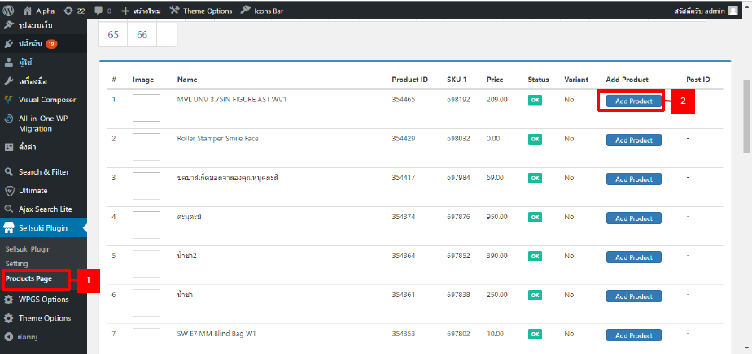
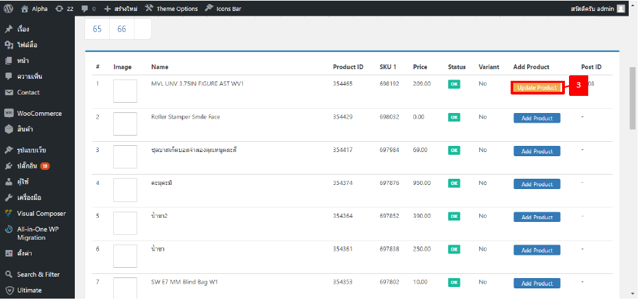
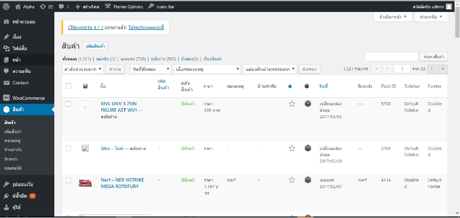
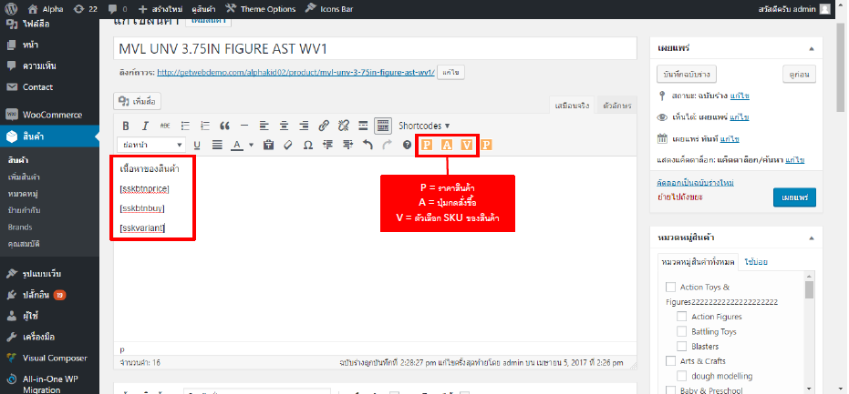

# Add Product

Add Product คือการเพิ่มสินค้า จากระบบของ Sellsuki เข้าระบบของผู้ใช้ใน Wordpress โดยการใช้งาน Add Product นี้ จะต้องผ่านการติดตั้ง Plug-in ของ Sellsuki และใส่ Sellsuki Key เรียบร้อยแล้ว วิธีการ Add Product มีขั้นตอนดังนี้

ขั้นแรกให้เข้าไปที่ Sellsuki Plugin แล้วเลือก "**Product Page**" จากนั้น เลือกสินค้าที่ต้องการเพิ่มในร้านค้าของผู้ใช้ โดยคลิก "**Add Product**"



จากนั้นปุ่ม "Add Product" จะเปลี่ยนเป็น "Update Product" ซึ่งถ้าเราคลิกที่ "**Update Product**" สินค้านั้นจะถูกนำเข้าร้านค้าของผู้ใช้ใน Wordpress ทันที



เราสามารถเช็คข้อมูลสินค้าที่เรานำเข้าระบบ Wordpress ได้โดยไปที่เมนู "**สินค้า**" จะพบว่ามีสินค้าเข้ามาในระบบแล้ว



### แก้ไขสินค้า

ในกรณีที่เราต้องการแก้ไขรายละเอียดต่างๆ ของสินค้า หรือต้องการดึงข้อมูลบางอย่าง โดยให้มีการอัพเดตอัตโนมัติ เมื่อข้อมูลสินค้าในระบบของ Sellsuki มีการเปลี่ยนแปลง เราสามารถทำได้โดยวิธีดังนี้

ขั้นแรกให้เข้าไปที่เมนู "**แก้ไขสินค้า**" ใน Wordpress



เราสามารถพิมพ์ข้อความรายละเอียดของสินค้าได้ตามที่ต้องการ 

แต่ถ้าต้องการให้ดึงข้อมูลมาจากระบบของ Sellsuki แบบอัตโนมัติ สามารถทำได้ 3 อย่างคือ  

* ราคาสินค้า

```
[sskbtnprice]
```

* ปุ่มกดสั่งซื้อสินค้า

```
[sskbtnbuy]
```

* ตัวเลือก SKU ของสินค้า

```
[sskvariant]
```


### การสร้างตะกร้าสินค้าบน Website

ผู้ใช้สามารถสร้างตะกร้าสินค้าบน Website ได้โดยนำโค้ดด้านล่างใส่ไว้ในตำแหน่งที่ต้องการให้มีตะกร้าสินค้าปรากฎ

```html
<div class="ssk-cart-wrap">
    <button id="sellsuki-cart"
class="sellsuki-button--cart">
        <i class="sellsuki-open-carticon"></>
        <span id="sellsuki-notification"
class="sellsuki-button--
cart__noti">{price}</span>
    </button>

</div>
```


